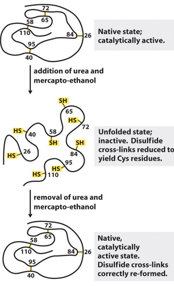

# 1. Introducción

El plegamiento de macromoléculas es el proceso mediante el cual proteínas y ácidos nucleicos adquieren su estructura tridimensional funcional. Aunque la secuencia primaria contiene toda la información necesaria, el proceso físico-químico que conduce a la conformación nativa es altamente complejo.

---

# 2. Plegamiento y Desnaturalización

La desnaturalización ocurre cuando una macromolécula pierde su estructura tridimensional debido a cambios en:

- Temperatura
- pH
- Solvente
- Agentes químicos desnaturalizantes

## Experimento de Anfinsen

Anfinsen (1961) demostró que:

- La información para el plegamiento está contenida en la secuencia.
- Algunas proteínas pequeñas pueden renaturalizarse espontáneamente.
- El plegamiento es termodinámicamente favorable.

Sin embargo, proteínas grandes pueden requerir chaperoninas.

**Figura 2.** Reprresentacion de la idea de Anfisen

---

## Temperatura de fusión (Tm)

En ácidos nucleicos:

- Tm ∝ contenido GC
- GC → 3 puentes de hidrógeno
- AT/AU → 2 puentes de hidrógeno

Si T > Tm → separación de hebras  
Si T disminuye lentamente → hibridación

---

# 3. Fuerzas que Influyen en el Plegamiento

Principales fuerzas:

- Hidrofobicidad
- Puentes de hidrógeno
- Interacciones de Van der Waals
- Puentes disulfuro
- Puentes salinos

En medio acuoso:

- Superficie → residuos hidrofílicos
- Interior → residuos hidrofóbicos

---

## Escala de Hidrofobicidad (Kyte & Doolittle, 1982)

| Aminoácido | Valor | Aminoácido | Valor |
|------------|-------|------------|-------|
| A | 1.8 | M | 1.9 |
| C | 2.5 | N | -3.5 |
| D | -3.5 | P | -1.6 |
| E | -3.5 | Q | -3.5 |
| F | 2.8 | R | -4.5 |
| G | -0.4 | S | -0.8 |
| H | -3.2 | T | -0.7 |
| I | 4.5 | V | 4.2 |
| K | -3.9 | W | -0.9 |
| L | 3.8 | Y | -1.3 |

Valores positivos → hidrofóbicos  
Valores negativos → hidrofílicos

---

# 4. Complejidad Algorítmica

El plegamiento es:

- Termodinámicamente favorable
- Rápido (segundos)
- Computacionalmente complejo

Se modela como un **embudo energético (folding funnel)**:

- Mínimo global → estado nativo
- Mínimos locales → estados metaestables

**Figura 2.** Representación esquemática del embudo energético del plegamiento proteico.

---

# 5. Paradoja de Levinthal

Supongamos:

- X estados por residuo
- 100 residuos
- t = 10^-13 s por cambio

Tiempo total explorando todo el espacio:

T = t * X^100

Para X = 10:

T = 10^-13 × 10^100 = 10^87 s

Comparado con ~5 segundos reales de plegamiento en E. coli.

Conclusión:

El plegamiento NO es aleatorio.  
Es un proceso guiado por etapas.

---

# 6. Velocidad de Plegamiento

## Orden de Contactos (CO)

CO = (1 / (L·N)) Σ Σ Sij

Donde:
- L = longitud
- N = número de contactos
- Sij = separación en secuencia

Existe correlación entre CO y velocidad de plegamiento.

---

## Modelo de Gong et al. (2003)

ln(kp) = 8.9T + 14H + 5.5B + 121.4L − 2.8

Sugiere que la formación de estructura secundaria es limitante.

---

# 7. Modelos Computacionales

## 7.1 Modelo HP Bidimensional

- Alfabeto: {H, P}
- Malla 2D
- Sin cruces
- Energía basada en interacciones

### Matriz de interacción

|   | P | H |
|---|---|---|
| P | 0 | -1 |
| H | -1 | -3 |

El estado nativo minimiza la energía total.

---

## 7.2 Dinámica Molecular

La energía potencial se modela como:

V(rN) = w1·enlaces + w2·ángulos + w3·torsiones + w4·interacciones

Permite simular movimiento atómico en picosegundos.

Es costoso computacionalmente.

---

# 8. Foldit

Foldit es un juego científico que permite:

- Manipular estructuras proteicas
- Optimizar puentes de hidrógeno
- Reducir choques estéricos

Es una herramienta educativa y de ciencia ciudadana.
