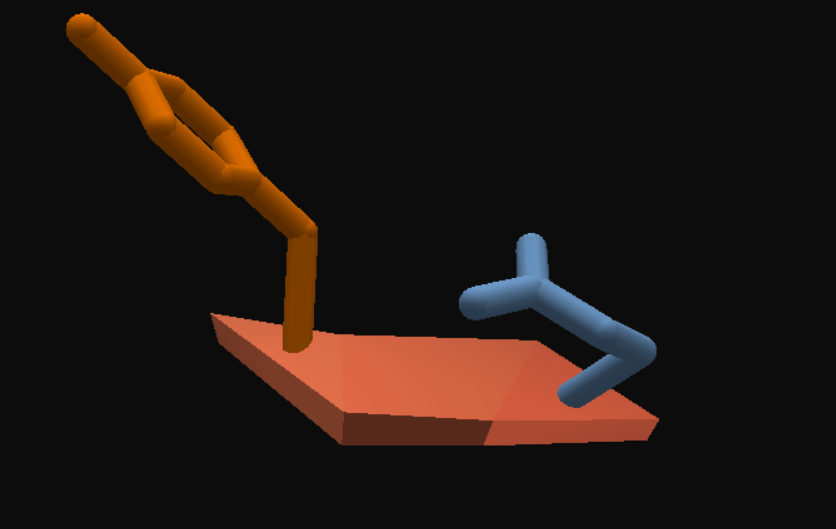
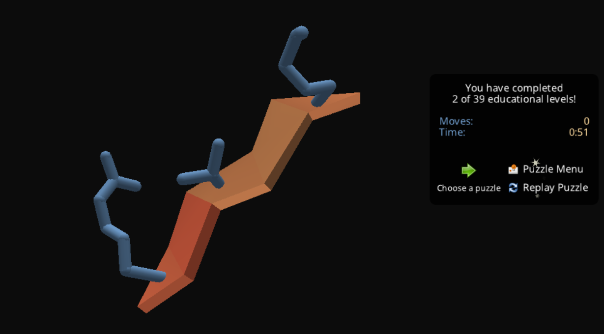
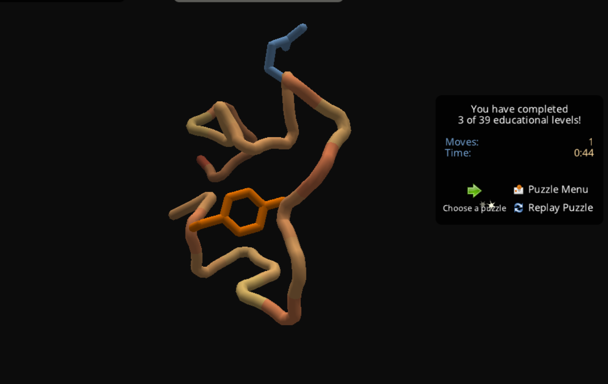
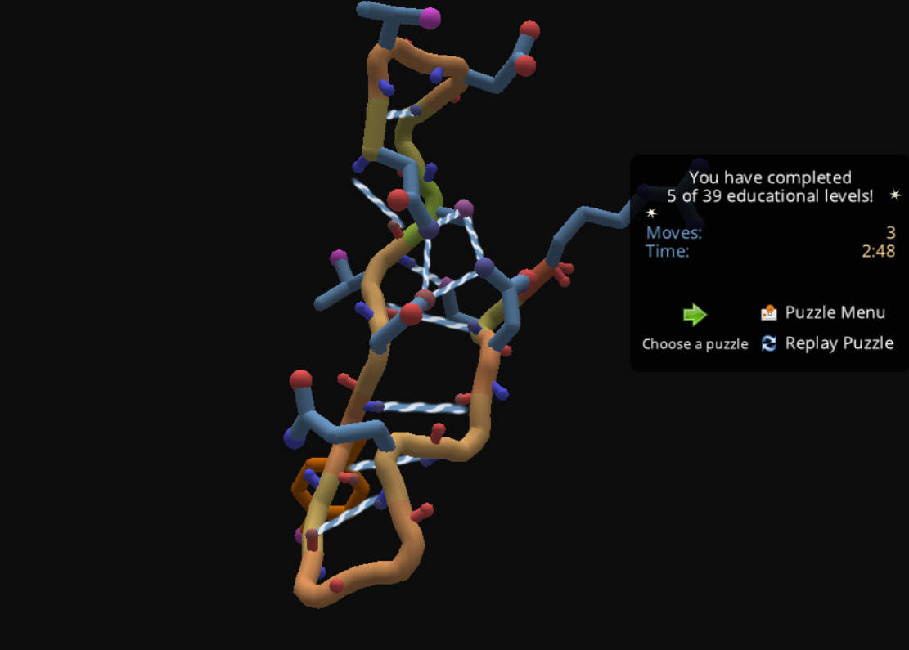

# 1. Introducción

Foldit es una plataforma interactiva que permite explorar los principios físicos del plegamiento de proteínas mediante manipulación directa de estructuras tridimensionales.

El objetivo de esta práctica fue completar cinco niveles del tutorial para identificar:

- Principios de estabilidad estructural
- Importancia de la hidrofobicidad
- Formación de puentes de hidrógeno
- Minimización de choques estéricos
- Optimización de energía total

---

# 2. Metodología

Se completaron los primeros cinco niveles del tutorial de Foldit.

En cada nivel se buscó maximizar el puntaje energético mediante:

- Reacomodo de cadenas laterales
- Optimización de puentes de hidrógeno
- Reducción de tensiones geométricas
- Minimización de cavidades internas

---

# 3. Resultados por Nivel


Reflexiónes: 

1. El plegamiento no es aleatorio; sigue una dirección energética.
2. Nivel 3 – Hidrofobicidad ; Se observó que los residuos hidrofóbicos deben orientarse hacia el interior. En medio acuoso, el núcleo proteico tiende a ser hidrofóbico.
3.

```{r, echo=FALSE, out.width="70%"}




knitr::include_graphics("figures/Level5_foldit.png")
```

# 4. Discusión

Foldit permite visualizar de forma intuitiva el concepto de embudo energético:

- Estados intermedios
- Mínimos locales
- Búsqueda del mínimo global

El juego evidencia que el plegamiento es un proceso guiado y no completamente aleatorio, en concordancia con la paradoja de Levinthal.

Además, reproduce principios básicos utilizados en dinámica molecular y modelado estructural.

---

# 5. Conclusiones

La experiencia permitió conectar conceptos teóricos con:

- Energía libre
- Estabilidad estructural
- Interacciones no covalentes
- Organización tridimensional

Foldit es una herramienta pedagógica eficaz para internalizar principios biofísicos del plegamiento proteico.

---

# 6. Evidencia

(Aquí puedes insertar capturas de pantalla)

